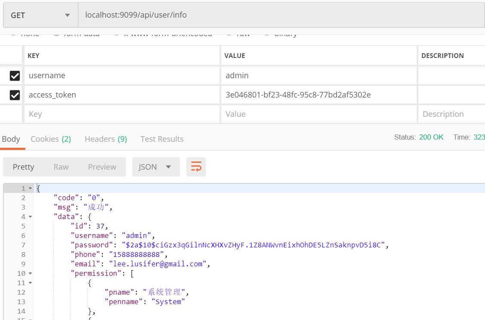
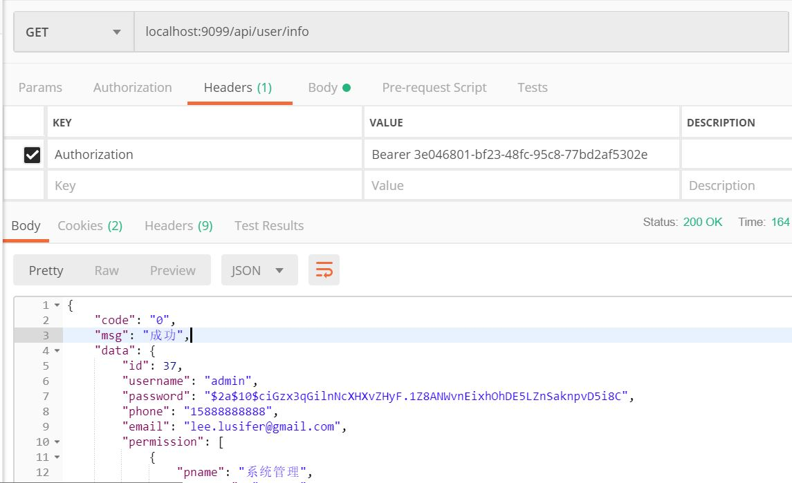

## javayh-resource

## 服务使用流程

- 初始化数据脚本 

  `doc/sql/sso/user.sql`

  `doc/sql/sso/oauth.sql`

 
- [获取token的流程](../../javayh-sso/javayh-server/README.md)

- 访问资源

    [localhost:9099/api/user/info](localhost:9099/api/user/info)
    
这时有两种方式访问:

1. access_toke

表单携带

2.Authorization

headers携带

